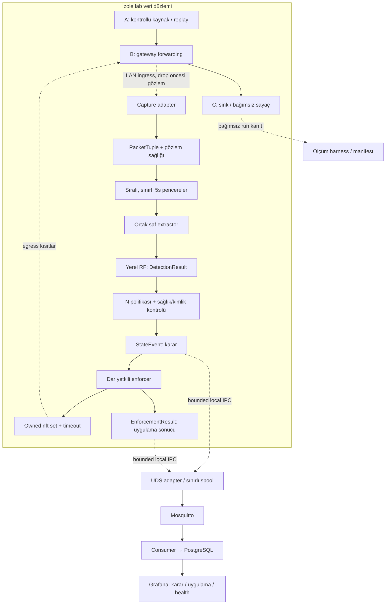

# OmniGuard eAI — V3 mimari tasarımı

10 Eylül 2026. Durum: mevcut V2 temeli üzerinde önerilen geliştirme tasarımı.
Bu dosyanın varlığı yeni bileşenlerin uygulandığı veya yeni sözleşmelerin ekipçe
onaylandığı anlamına gelmez. Gerçek durum: [STATUS](docs/STATUS.md).
Gerekçe ve 2026 kaynakları: [değerlendirme](docs/architecture/REVIEW_2026.md).

## Amaç ve korunacak temel

Teknik bilgisi olmayan kullanıcı üzerindeki güvenlik yükünü azaltmak için,
IoT cihazının gateway'den geçen zararlı dış trafik davranışını payload'dan
bağımsız özelliklerle tespit etmek ve süreli, geri alınabilir egress kısıtlaması
uygulamak. Ağdaki bütün zararlıları bulmak veya cihazı temizlemek kapsam dışıdır.

Korunur: yerel Random Forest, ortak saf extractor, PCAP/canlı adapter eşitliği,
5 saniye tumbling baseline, capture-aware split, validation-only seçim,
Linux netns+nftables, UDS, Mosquitto/PostgreSQL/Grafana, laptop fallback.
Pi 5 ayrı ARM64 hedefidir. Managed cloud ve ONT firmware erişimi gerekmez.

## Uygulanan ile önerilenin ayrımı

| Bileşen | Durum |
|---|---|
| Beş runtime envelope, SCHEMA_VERSION 0.1.0 | Onaylı; önceki Linux PR'ında freeze kaydı var |
| Classic PCAP normalizer, deterministic stubs | Uygulandı/test edildi |
| Sabit IPv4 UDP netns karantina/release | Gerçek Linux smoke geçti; genel runtime değil |
| Compose/MQTT/SQL/Grafana servis sağlığı | Çalışıyor; uygulama event zinciri değil |
| Saf extractor, RF/eşik eğitim kodu, artifact loader, live adapter | PR #7/#11–15 ile uygulandı; gerçek veri/model sonuçları bekliyor |
| State policy, bounded enforcer, observation health, uygulama sonucu | V3 tasarım/uygulama işi |
| UDS bridge, consumer, event tabloları/dashboard | Bekliyor |
| G5/G8/G10, gerçek leakage/FPR/Pi sonuçları | Geçilmedi |

## Bileşenler ve yetki sınırları

Aşağıdaki şema hedef akışı gösterir; bütün kutular bugün uygulanmış değildir.

Model, policy ve telemetry süreçleri firewall yetkisi taşımamalı. Capture yardımcısı
sadece gerekli capture yetkisini; enforcer yalnız B'deki yönetilen tabloyu değiştirme
yetkisini alır. Başlangıç lab kurulumu ayrı root işidir. Enforcer namespace inode,
table ownership, sabit komut şablonu ve yetkili device binding doğrular. Modelden,
MQTT mesajından veya kullanıcı metninden shell/nft kodu türetilmez.

Bu yetki ayrımı henüz uygulanmadı. Mevcut `lab/run_docker.sh`, yönetilen benign
smoke için NET_ADMIN/SYS_ADMIN kullanır; üretim gateway izolasyonu olarak sunulmaz.

## Veri sözleşmeleri

[SCHEMA.md](SCHEMA.md) ve `core/schema.py` mevcut 0.1.0 için tek kaynak.
PacketTuple, FeatureVector, DetectionResult, StateEvent, TelemetryPayload değişmez.
StateEvent bir politika geçişidir; tek başına uygulanmış firewall veya sink kanıtı
sayılmaz. Mevcut StateEvent alanlarına gizli JSON/metrik doldurulmaz.

[ADR-0002](docs/adr/0002-bounded-containment.md) şu ekleri önerir:

- ObservationHealth: pencere kapsamı, drop/overflow, kaynak ve zaman kalitesi.
- EnforcementResult: karar kimliği, başarılı/başarısız/uzlaştırılmış uygulama,
  monotonic işlem aralığı, doğrulanan namespace ve süre sınırı.
- Ayrı versioned DetectionRecord ve HealthRecord: dashboard score/health bilgisi.
- Sürümlü run manifest, device binding ve policy config; ML girdisi değiller.

Önce schema/ADR review, sonra kod. Mevcut TelemetryPayload yalnız StateEvent taşır;
yeni türleri eski 0.1.0 tüketicisine sessizce gönderme. Tip başına ayrı sürümlü topic
veya yeni envelope seçimi R1/R2/R3 review'ında yapılmalı.

## Capture, kimlik ve pencere davranışı

- LAN tarafında, drop'tan önce tek capture noktası. Aynı paketi iki interface'ten
  çift sayma; GRO/GSO/TSO ve offload ayarlarını manifestte kaydet.
- DeviceBinding açık IP→cihaz haritasıdır; fixture haritası güvenli kimlik doğrulama
  değildir. Üretim DHCP/IP yeniden kullanımı/MAC spoofing için ayrıca kanıt gerekir.
  Belirsiz binding ile yeni otomatik blok yok; binding sürümü her karara bağlanır.
- EGRESS: kaynak LAN içinde, hedef dışında ve ortak özellik dışlama politikası dışında. LOCAL ayrı. IPv4-only lab için IPv6
  kapalı ve testli; üretimde IPv6'yı görmezden gelerek containment iddiası kurulmaz.
- Mevcut parser tam IP uzunluğunu bekler. Kısa snaplen açıp parser'ın truncated
  paket reddini kapatmak çözüm değil. Header-only adapter için captured/original
  length, fragment ve extension-header semantiği ayrıca tasarlanmalı.
- Timestamp paket/event için UTC; süre için aynı host/boot monotonic clock.
  Kaynak PCAP zamanını performans başlangıcı gibi çıkarma. Replay dönüşümü saklanır.
- 5s half-open, epoch-aligned pencereler. Başlangıç kısmî pencere, geç paket,
  sırasız kayıt, kapanmış pencere ve saat sıçraması politikası manifestte sürümlenir.
- Kuyruk, cihaz sayısı, pencere birikimi ve cardinality için bellek sınırları vardır.
  Taşma/drop sessizce yutulmaz; etkilenen pencereler untrusted olur.
- Trafiksizlik, capture arızası ve gözlenmiş benign trafik üç ayrı durumdur.
  Baseline'da boş/invalid/gap pencere anomaly serisini sıfırlar; modele otomatik
  sıfır vektör verip NORMAL denmez. Health, DeviceState enum'una sıkıştırılmaz.

## Karar, uygulama ve süre sınırı

N, yalnız ardışık ve kullanılabilir pencerelerdeki ANOMALOUS sonuçları sayar.
N=1 ilk geçerli anomaly'de kısıtlama isteği üretir; SUSPICIOUS geçişi ile bir fazla
pencere beklenmez. İki state eventi gerekiyorsa aynı karar döngüsünde sıralanır.
Benign/invalid/gap pencere seriyi keser. Geçmiş skorlar yeni model/policy sürümüne
geçerken birbirine eklenmez. RF skoru kalibre olasılık veya güven garantisi değildir.

Genel enforcer için önerilen işleyiş:

1. Kararı ve binding'i doğrula; transaction kimliği üret, karar zamanını kaydet.
2. Karantinayı owned nft set'e **süreli** element olarak atomik uygula.
3. Başarı kodu + kernel readback ile doğrula; sonuca göre EnforcementResult üret.
4. UI karar ile uygulama sonucunu ayrı gösterir; sink kanıtı ayrı measurement'tır.
5. Kernel expiry, manual release ve restart uzlaştırması süreyi sınırlar.

Karar kaydı network/disk/broker bekleyerek kritik yolu bloke etmez; sabit kapasiteli
kuyruk ve belirgin başarısızlık sayacı gerekir. G8, exporter kapalıyken de geçmeli.
Model/health arızasında yeni otomatik karantina başlatılmaz; mevcut lease son
süresinde biter. Bu kullanılabilirlik odaklı hata politikasıdır; arıza sırasında
saldırı trafiği kaçabilir ve ölçülmelidir. Kalıcı fail-closed tasarımı kapsam dışı.

Lease aynı kanıtla tekrar tekrar uzatılmaz. Tek karar için `max_lease`, episode
başına toplam kısıtlama sınırı ve tekrar karantina sayacı tanımlanır. Sayısal sınırlar
validation/deney planında seçilir; 60s bir garanti değil aday konfigürasyondur.
Release enfeksiyonu tedavi etmez; NORMAL bir policy durumudur, "cihaz temiz" hükmü
vermez. Onaylı mevcut enum korunarak incident geçmişi ayrı kayıtta tutulur.

Karantina cihazın WAN egress'ini kısıtlar; sadece kötü bağlantıyı seçici kesme
iddiası yoktur. Mevcut A→B→C smoke yerel uygulamanın kullanılabilirliğini test etmez.
Yeni G8 testinde aynı cihaz için lokal servis probe'u eklenmeli; yerel ağda kalması
lateral movement'ı engellemez. Bu güvenlik/kullanılabilirlik tercihi sunumda açık olur.

Established accept'ten önce quarantine kontrolü gerekir. Flowtable/hardware
fastpath, normal forward yolunu atlayabilir: referans deneyde kapalı olmalı,
yeni platformda ayrıca kontrol edilmeli. Sadece conntrack temizlemek yeterli kanıt
sayılmaz [Linux açıklaması](https://docs.kernel.org/networking/nf_flowtable.html).
Kernel expiry desteği [nftables kaynağında](https://wiki.nftables.org/wiki-nftables/index.php/Element_timeouts)
açıklanır; bizim timeout/restart davranışımız ayrıca gerçek test ister.

## UDS ve platform arızaları

Network namespace dosya sistemi paylaşımını otomatik olarak garanti etmez.
Doğrudan netns çalışmasında pathname UDS erişilebilir olabilir; Docker runner
host socket'ini bugün paylaşmıyor. G10 runner'ı için yalnız gerekli socket dizini,
UID/GID ve izinler açıkça tasarlanmalı; Docker socket veya host kökü paylaşılmaz.
Telemetry namespace'i lab'a TCP/Internet rotası açmaz.

UDS için bounded frame, maximum message size, peer credentials ve write timeout;
spool için max bytes/age, doluluk ve drop sayacı gerekir. MQTT QoS1 duplicate
üretebilir: event_id ilk üreticide sabitlenir, retry'da değişmez. DB uniqueness,
transaction ve tekrar işleme politikası bunu karşılar; "exactly once" denmez.
ACK'in broker teslimini mi durable DB commit'i mi anlattığı ayrı belirtilir.

Broker/consumer kapalı veya spool doluyken G8 çalışmalı. Kesinti sırasında kayıt
kaybı olursa G10 completeness sonucu başarısız/eksik olarak işaretlenir; yeniden
bağlandı diye hiç kayıp olmadığı varsayılmaz. Eski event yeni device state'i geri
alamamalı: producer boot/run + sequence düzeni ve replay sınırı belirlenmeli.

Grafana kullanıcıları enforcement komutu göndermez. Geliştirme MQTT ortak hesabı,
üretim yetkilendirmesi değildir; ileride publisher/consumer/health ayrı ACL,
read-only dashboard DB rolü ve kontrollü yönetim yolu gerekir.

## Artifact ve veri yaşam döngüsü

Model yalnız yerelde üretilmiş veya kaynağı ayrıca doğrulanmış artifact olabilir.
Aynı yerden indirilen model ve SHA-256 dosyası tek başına güvenilirlik sağlamaz;
hash güvenilen manifest/registry kaydıyla karşılaştırılır. joblib yükleme kod
çalıştırabilir: model süreci enforcer yetkisi taşımaz. Hedefte Python/sklearn/numpy/scipy/joblib
sürümleri ve feature_order yüklemeden önce doğrulanır. Birleşen PR #11
yalnız Python/sklearn/numpy kontrol eder; tam ML ortamı KAN-10 ile kilitli,
scipy/joblib explicit loader kontrolü versioned KAN-9 takibidir. Uyumsuzlukta sessiz fallback
veya otomatik yeniden eğitim yok; health hatası ve kontrollü son-iyi-sürüm politikası.
ONNX/skops'a geçiş ancak destek/parity/RAM/latency ölçümü ve ayrı artifact ADR'siyle.

Raw PCAP yalnız kontrollü dataset/fixture alanında; uygulama payload saklamaz veya
telemetriye göndermez. PacketTuple IP/MAC/port bilgisi geçici yerel metadata'dır;
kalıcı feature/event/measurement kayıtlarının izin verilen alanları, erişimi ve
saklama süresi run manifestte belirlenir. Metadata da hassas olabilir. Eski model,
spool ve raw deney çıktıları için byte/age sınırları açık olmalıdır. Bu PoC'nin
payload-independent olması anonimlik veya hukuki uyumluluk sertifikası değildir.

## Ölçüm sözleşmesi

- `t0`: bilinen senaryonun ilk zararlı paketi kaynakta monotonic olarak işaretlenir.
- `t_decision`: geçerli N politikasının karar anı.
- `t_apply_begin`, `t_apply_ack`: kernel işlem aralığı; atomik uygulamanın tam anı
  bu aralıktadır. ACK zamanı tek başına ilk/son paketin geçiş zamanı değildir.
- Sink teslim kayıtları/counter, packet sırası ve eşzamanlı saat örnekleriyle
  uygulama sonrası geçiş ayrı ölçülür. Drain sırasında kaçan byte rapordan silinmez.
- Rapor: `t0→decision`, `decision→ACK`, `t0→ACK` ve ACK sonrası in-flight/bypass
  byte'ları. Analiz başlangıç/bitiş ufku ve t1 operasyonel tanımı sabittir.
- Tespit edilmeyen saldırı run'ları atılmaz: bitiş ufkuna kadar kaçış ve censored
  latency/containment başarısızlığı olarak raporlanır.

W=5s için saldırının başladığı pencere de anomalous sayılırsa N pencere kararının
faz bağımlı beklemesi yaklaşık `(N−1)W` ile `NW` arasındadır; extraction/inference
ve scheduling eklenir. N=3 her koşulda "minimum 15s" değildir. Kısmi pencere
sayılmıyorsa başka aralık çıkar; deney hangi politikayı kullandığını yazar.

Window FPR yanında false quarantine/device-hour, benign blocked seconds/device-hour,
local service success, release recovery time, incident recall, p50/p95 stage latency,
L3 leakage, capture/queue drops ve tüm core+exporter CPU/RSS raporlanır.
Telemetri hacminde application JSON, UDS, MQTT ve varsa TLS/wire overhead ayrıdır.
Grafana/Postgres maliyeti platform sütununda, exporter maliyeti edge sütunundadır.
Ardışık pencerelerin bağımsız olduğu varsayılıp `FPR^N` garanti olarak sunulmaz.

## Araştırma deneyi ve maliyet sınırı

Aynı capture/episode gruplarıyla train, validation, test ayır; feature selection,
preprocessing ve model fit yalnız train; threshold/N/lease aday seçimi validation.
Test yalnız sabitlenmiş adayların nihai değerlendirmesi içindir. Birbirinin parçaları
olan PCAP dosyalarını ayrı bağımsız grup sayma. Bootstrap/CI capture/episode
seviyesinde; yeterli bağımsız benign süre yoksa güven iddiasını daralt.

Baselines: detection-only/no enforcement, basit rate kuralı, RF+N=1, RF+N adayları.
No-enforcement run kaçışı karşılaştırmak içindir, başarılı savunma sayılmaz.
Feature ablation gerçek extractor kataloğundan türetilir; uydurma 40 özellik yok.
Minimum karşılaştırma matrisi ve koşullar [uygulama planındadır](docs/architecture/EXECUTION_V3.md).
Online policy sweep canlı etkileşimi ikame etmez; adaptive eBPF/ONNX/ML ancak
profilleme sonucu ve ayrı ADR ile alınır. Aynı anda hepsini eklemek hedef değil.

12 Eylül ekip incelemesi: [kararlar ve Jira takibi](docs/architecture/REVIEW_RESOLUTION_2026-09-12.md).

## 14 Eylül — KAN-15 / KAN-33 ölçüm sınırı

PR #29 ortak özellik politikası tüm multicast hedeflerini EGRESS özelliklerinden
çıkarır; bu hedeflerin fiziksel olarak yerel linkte kaldığını garanti etmez.
Yönlendirilebilir IPv4 multicast ve global kapsamlı IPv6 multicast de dışlanır.
KAN-33/G8 kaçış ölçümü Direction.EGRESS filtresinden bağımsız sink/forwarding
kanıtına dayanmalıdır. Protokol, adres ailesi ve gözlem noktası kapsamı kaydedilir;
gözlenmeyen trafik sıfır kaçış diye raporlanmaz. features-1 eğitim değerleri korunur.
