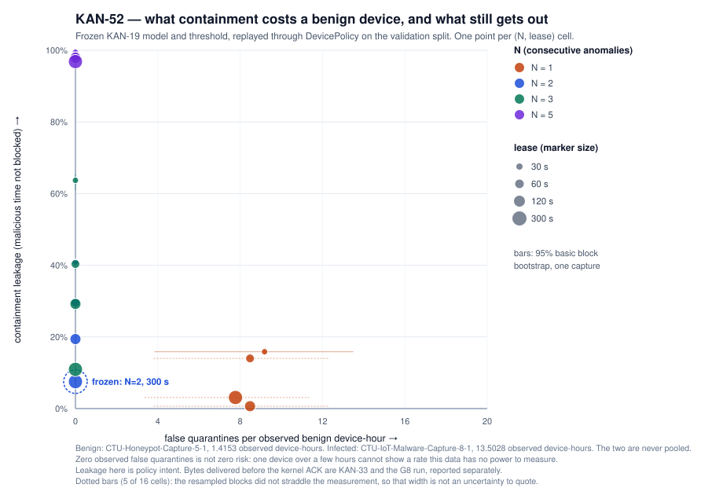

# KAN-52 — what containment costs, and what still gets out

Owner: R1 (Onur). Run of 22 September 2026. Reproduce with:

```sh
python -m model.leakage_run \
    --pack ~/omniguard-data/samplepack-v2-20260915T111555Z/windows.jsonl \
    --artifact ~/omniguard-data/runs/kan19/operating \
    --out ~/omniguard-data/runs/kan52
```

KAN-51 chose **N = 2, lease = 300 s**. This card measures the trade-off that choice
sits on: for every cell of the same grid, what a benign device pays and how much of
the attack still gets through. Both numbers come from one run of the frozen KAN-19
model replayed through `gateway.policy.DevicePolicy`; nothing here retrains,
re-thresholds or re-selects anything.

> **What "leakage" means here.** Observed malicious window-time during which the
> infected device was *not* under quarantine, measured as interval overlap. It is a
> policy decision, not a packet count. The bytes an independent sink receives before
> the kernel ACK are [KAN-33](KAN33_LEAKAGE.md) and the G8 run; the two are reported
> side by side and never added.

**Spec.** [`model/leakage_spec.json`](../model/leakage_spec.json), fixed before the
run. It pins the model (`d30725a9…`), the metadata (`917504c1…`), the threshold
`0.9798815486832`, `features-1`, the KAN-51 grid, and the rule that the test split
stays shut until an approval is recorded in the spec itself.

## What was measured, on what

| Capture | Role | Windows | Observed | Span | Observed share | Activity segments | Silence |
|---|---|---:|---:|---:|---:|---:|---:|
| CTU-Honeypot-Capture-5-1 | benign device | 1,019 | 1.42 h | 5.00 h | 28 % | 714 | 3.59 h |
| CTU-IoT-Malware-Capture-8-1 | infected device | 9,722 | 13.50 h | 24.00 h | 56 % | 4,398 | 10.50 h |

The benign capture has 14 anomalous windows; the infected one has 8,686 malicious
windows, 8,211 of them anomalous. Its 1,036 benign-labelled windows belong to the
infected device, are reported apart, and **none** of them was flagged.

**Benign modes (idle, active, startup, update) are not available.** IoT-23 carries no
mode or scenario label, and inventing one by reading the traffic would be a label the
data does not have. What the capture can answer about its own shape — segments, gaps,
observed share of span — is in the table above. Real mode labels arrive with KAN-66's
controlled Pi scenarios and are evaluated in KAN-65.

## Result

Benign cost is on the left, leakage on the right. The two belong to different devices
and are never pooled.

| N | Lease | False quarantines | per observed device-hour | per span hour | Benign blocked s per span hour | Containment leakage | Interval | Bias | Detection delay |
|---:|---:|---:|---:|---:|---:|---:|---|---:|---:|
| 1 | 30 s | **13** | 9.19 (3.8–13.5) | 2.60 | 77.9 | 15.9 % | 15.0–16.8 % | +0.000 | 5.5 s |
| 1 | 60 s | **12** | 8.48 (3.8–12.3) | 2.40 | 143.9 | 14.0 % | 14.1–15.6 %¹ | −0.008 | 5.5 s |
| 1 | 120 s | **12** | 8.48 (3.8–12.3) | 2.40 | 287.8 | 0.7 % | 0.0–0.0 %¹ | +0.026 | 5.5 s |
| 1 | 300 s | **11** | 7.77 (3.4–11.4) | 2.20 | 659.4 | 3.1 % | 3.7–4.2 %¹ | −0.009 | 5.5 s |
| 2 | 30 s | 0 | 0.00 (0.0–0.0) | 0.00 | 0.0 | 40.9 % | 39.8–41.1 % | +0.004 | 10.5 s |
| 2 | 60 s | 0 | 0.00 (0.0–0.0) | 0.00 | 0.0 | 29.6 % | 28.6–30.0 % | +0.003 | 10.5 s |
| 2 | 120 s | 0 | 0.00 (0.0–0.0) | 0.00 | 0.0 | 19.4 % | 19.6–21.3 %¹ | −0.011 | 10.5 s |
| **2** | **300 s** | **0** | **0.00 (0.0–0.0)** | **0.00** | **0.0** | **7.5 %** | **7.1–7.9 %** | **−0.000** | **10.5 s** |
| 3 | 30 s | 0 | 0.00 (0.0–0.0) | 0.00 | 0.0 | 63.7 % | 61.0–65.4 % | +0.005 | 15.5 s |
| 3 | 60 s | 0 | 0.00 (0.0–0.0) | 0.00 | 0.0 | 40.4 % | 38.7–40.5 % | +0.007 | 15.5 s |
| 3 | 120 s | 0 | 0.00 (0.0–0.0) | 0.00 | 0.0 | 29.2 % | 27.2–29.3 % | +0.010 | 15.5 s |
| 3 | 300 s | 0 | 0.00 (0.0–0.0) | 0.00 | 0.0 | 10.9 % | 8.1–9.6 %¹ | +0.021 | 15.5 s |
| 5 | 30 s | 0 | 0.00 (0.0–0.0) | 0.00 | 0.0 | 99.4 % | 99.2–100 % | −0.002 | 4,860.5 s |
| 5 | 60 s | 0 | 0.00 (0.0–0.0) | 0.00 | 0.0 | 98.5 % | 97.6–100 % | −0.003 | 4,860.5 s |
| 5 | 120 s | 0 | 0.00 (0.0–0.0) | 0.00 | 0.0 | 97.9 % | 97.2–100 % | −0.009 | 4,860.5 s |
| 5 | 300 s | 0 | 0.00 (0.0–0.0) | 0.00 | 0.0 | 96.9 % | 96.3–100 % | −0.023 | 4,860.5 s |

¹ The resampled runs did not straddle the measurement in this cell: the bias is larger
than the spread, so the interval is not an uncertainty to quote. The measurement
stands; the width does not. These cells are drawn with a dotted bar in the figure.



## What this says

1. **N = 1 is the expensive setting, and the lease makes it worse.** 14 isolated
   anomalous windows on a healthy device become 11–13 quarantines — 7.8 to 9.2 per
   observed device-hour. At a 300 s lease that device spends 659 s of every span hour
   cut off, for nothing. This is the cost the headline figure exists to show.
2. **At N ≥ 2 the benign cost on this capture collapses to zero,** because none of
   those 14 windows has an anomalous neighbour. The trade-off then lives entirely in
   the lease: at N = 2 leakage falls from 40.9 % at 30 s to 7.5 % at 300 s.
3. **Zero is not zero risk.** Zero events in 5.0 device-hours of span is consistent
   with a true rate up to about **0.6 false quarantines per device-hour** (the usual
   rule-of-three bound, 3 / 5.0 h), or 2.1 per *observed* device-hour. One benign
   device for five hours cannot measure a rarer rate than that, and the frozen
   operating point must not be described as having none.
4. **Leakage is not smooth in the lease.** At N = 1 a 120 s lease leaks 0.7 % while
   300 s leaks 3.1 %. Longer is not monotonically better: after each expiry the policy
   needs a fresh anomaly series before it can quarantine again, and where those
   restarts land relative to the attack decides what is covered. The grid is coarse
   and this surface is bumpy; no cell here is an optimum.
5. **N = 5 loses the incident.** Five consecutive anomalous windows almost never occur
   in 8-1 (4,397 gap resets), so 96.9–99.4 % of malicious time goes unblocked and the
   first quarantine arrives 81 minutes in.
6. **The frozen point, measured here:** N = 2, 300 s — 0 false quarantines on the
   benign capture, 7.5 % of observed malicious time unblocked, 10.5 s to the first
   quarantine, and 257 re-quarantines over the capture.

## Test confirmation — one run, 22 September

The Lead approved spending the seed-1 test split on a single confirmation run (KAN-52
comment 11528): frozen model, threshold, `features-1`, seed 1, N = 2, lease = 300 s,
recorded in `model/leakage_spec.json` before the run, **one run, no tuning and no retry
afterwards**. `model/leakage_test_record.json` is what a reviewer would have to revert
to allow a second one.

| Capture | Role | Windows | Observed | Span | Anomalous windows | Activity segments |
|---|---|---:|---:|---:|---:|---:|
| CTU-Honeypot-Capture-7-1 | benign device, **declared label** | 9,770 | 13.57 h | 24.00 h | 3,380 (34.6 %) | 7,505 |
| CTU-IoT-Malware-Capture-3-1 (Muhstik) | infected device | 25,655 | 35.63 h | 36.13 h | 10,571 of 25,651 malicious | 4 |

**At the frozen operating point (N = 2, 300 s):** no false quarantine on 7-1, and
**50.6 % of 3-1's observed malicious time went unblocked** (interval 47.7–60.0 %), with
212 quarantine episodes and the same 10.5 s to the first one.

| N | Lease | False quarantines on 7-1 | per observed device-hour | Benign blocked s per span hour | Containment leakage | Interval |
|---:|---:|---:|---:|---:|---:|---|
| 1 | 30 s | **1,866** | 137.5 | 2,331 | 51.9 % | 46.9–59.1 % |
| 1 | 300 s | **277** | 20.4 | 3,450 | 50.0 % | 47.0–59.2 % |
| **2** | **300 s** | **0** | **0.0** | **0.0** | **50.6 %** | **47.7–60.0 %** |
| 3 | 300 s | 0 | 0.0 | 0.0 | 51.3 % | 48.9–61.2 % |
| 5 | 300 s | 0 | 0.0 | 0.0 | 55.5 % | flagged¹ |

### What the confirmation says

1. **The validation result does not transfer.** The same frozen policy left 7.5 % of
   malicious time unblocked on 8-1 and **50.6 % on 3-1**. The cause is upstream of the
   policy: at the frozen threshold only **41.2 %** of 3-1's malicious windows are
   anomalous at all, against 94.5 % on 8-1. N and the lease cannot contain what the
   threshold does not flag.
2. **The zero on the benign side is structural, not safety.** 34.6 % of 7-1's windows
   are individually anomalous — 3,380 of them — but the capture is 7,505 separate
   activity segments with 7,504 gap resets, so two anomalous windows almost never land
   in a row. N = 2 therefore cannot fire. The same capture at N = 1 produces **1,866
   false quarantines, 137.5 per observed device-hour**, and at a 300 s lease the device
   is cut off for 3,450 of every 3,600 wall-clock seconds. Reading this zero as "no
   false quarantines on unseen benign traffic" would be reading the gap structure, not
   the detector.
3. **The bound still applies, and it is weak.** Zero events in 24.0 device-hours of span
   is consistent with a true rate up to about 0.13 per device-hour; on observed hours,
   0.22. Neither number survives point 2.
4. **7-1's benign label is declared, not measured** (ADR-0004). Every figure in this
   section inherits that assumption.
5. **Nothing here may be tuned.** The grid is shown because hiding measured cells is
   worse than showing them, not because a better cell may now be selected. N, the
   lease, the threshold and the model stay as they were frozen.

¹ The N = 5 / 300 s cell is the one cell whose resamples did not straddle the
measurement; its width is not quoted. The other fifteen reproduce.

**Evidence.** Trimmed report
[`model/frozen/kan52/test/leakage_report.trimmed.json`](../model/frozen/kan52/test/leakage_report.trimmed.json)
`5a4fd035…`, figure `49ca6fc7…`, full run output `4f779cf1…` (outside Git), spec
`dec64b5a…`, record `model/leakage_test_record.json`.

## Uncertainty, and where it stops

Each capture is cut into 600 s blocks of wall-clock time; 200 resamples draw those
blocks with replacement, keeping each block's windows, inner gaps and edge silence, and
every resample is replayed through the same policy. A block is longer than the longest
lease, so one episode fits inside a block.

Each statistic reports four things: the measurement, the raw resample spread, the bias
between them, and a basic bootstrap interval reflected about the measurement. The bias
matters: leakage depends on how episodes and malicious stretches line up over hours,
which a 600 s block cannot reproduce. In 5 of 16 cells the resamples do not straddle
the measurement at all, and those intervals are marked rather than quietly reported.

**This interval is temporal variability inside one capture.** It is not a
device-to-device interval and no amount of resampling can make it one. The benign side
rests on a single honeypot device over five hours.

## Limits

- **One benign device, one infected device.** A per-device-hour rate from one capture
  is an observation, not a population estimate.
- **Validation data.** The threshold and the N/lease pair were chosen on these same
  windows, so this is the friendly case. The untouched estimates are the ADR-0004
  malware holdout, scored once under KAN-71 on 25 September, and, for benign devices,
  KAN-65 and KAN-70. KAN-21 is not that estimate: it closed on 14 September as a
  leave-one-family-out experiment over the development captures, every one of which has
  been on a test side, so nothing in it is untouched.
- **Policy intent, not packets.** Blocked seconds are what the policy decided. What
  actually stopped is KAN-33's sink measurement and the G8 run.
- **Replay timing.** Every window is decided 0.5 s after it closes; real capture and
  inference latency belongs to KAN-42.
- **Gaps reset the series** — the declared baseline. A max-gap variant is not measured.
- **The test split is spent.** It was scored once, on 22 September, under the approval
  recorded in the spec. 7-1's benign label is declared rather than published
  (ADR-0004), and every number from it says so.

## Evidence

| Artifact | SHA-256 |
|---|---|
| Spec (`model/leakage_spec.json`) | `4e3cd99454b1c9071c35fe633b2acc260cc8a510fd802c45056fe44d17dbc9f0` |
| Committed trimmed report | `66d6ad0caff9d35ef37c50ff6d000ad3e079cfe85239e3a9dd92002e92756ace` |
| Headline figure | `c87a8e3b739e54e9e19540fae74154341c2584e4483813a11b628c208b478991` |
| Full run output, kept outside Git | `15d1d27f2122014644c40e4a667d66850dcb93d738574ab4ff1edd0cc18527fa` |

The trimmed report reduces local paths to file names and drops per-episode lists, so a
rerun on another machine differs only in its `environment` block.

## What is needed next

1. Owner review of both results.
2. **The confirmation's negative result has to reach the delivery inventory** (KAN-54)
   and the presentation: the frozen operating point left half of an unseen malware
   capture's malicious time unblocked, and its clean benign side came from a capture
   whose traffic is too fragmented for N = 2 to fire.
3. New benign devices (KAN-66 capture, KAN-65 evaluation), so the benign cost does not
   rest on one honeypot or on one gap structure.
4. **The malware holdout has since been scored** (KAN-71, 25 September) and it points
   the same way, harder: on three untouched captures the frozen policy flagged 0 %,
   0 % and 1.5 % of malicious windows, including on 48-1, whose family is in the
   training data. Read together, validation (94.5 %), this confirmation (41.2 %) and
   the holdout describe one trend, not three separate observations.
